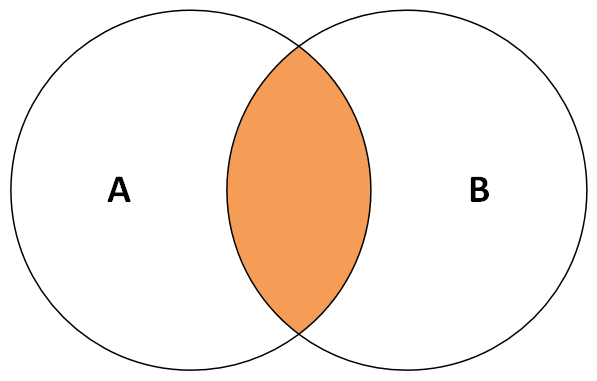
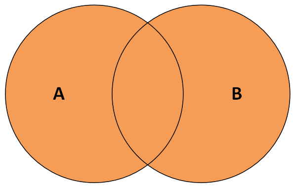
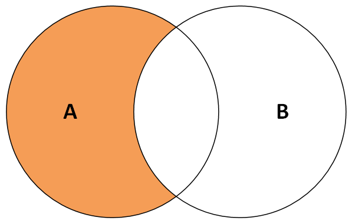
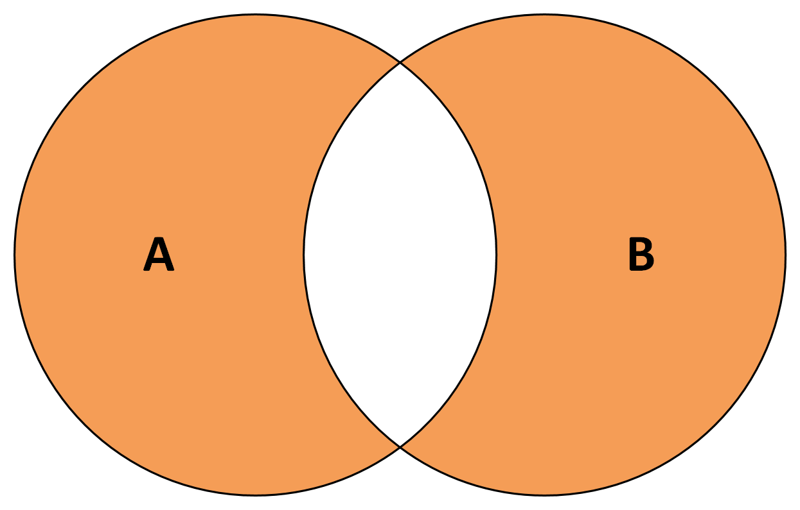

## `group_split()`
```r
df %>%
  # split by indicator and set name
  dplyr::group_split(
    indicator, # by
    .keep = T  # if keep the grouped variable
  ) %>%
  # set names
  purrr::set_names(
    purrr::map_chr(
      ., 
      ~ .x$indicator[1]
      )
  )
```

## `mutate()`
### `mutate_at()`
affects variables selected with a character vector or vars()
```r
scale2 <- function(x, na.rm = FALSE) (x - mean(x, na.rm = na.rm)) / sd(x, na.rm)
starwars %>% mutate_at(c("height", "mass"), scale2)
starwars %>% mutate(across(c("height", "mass"), scale2))
```

### `mutate_if()`
affects variables selected with a predicate function
```r
tbl %>% mutate_if(is.numeric, funs(replace_na(.,0)))

iris %>%
  as_tibble() %>%
  mutate(across(where(is.numeric), list(scale = scale2, log = log)))
```

## `rename()`
### `rename_at()`
```r
dplyr::rename_at(vars(BC:Interior), function(x) paste0(x,"_24"))
dplyr::rename_at(vars(-class), ~ paste0(., "_2014"))
```

### `rename_with()`
```r
rename_with(
  iris,
  ~ paste0("prefix_", .x, recycle0 = TRUE),
  starts_with("nonexistent")
)

data %>% 
  rename_with(
    .cols = matches('tally'),
    .fn   = ~ str_remove(.x, 'tally_')
  )
```

```r
# change all column names to title style except start with hsda
df %>% rename_with(str_to_title, !starts_with("hsda"))

# change all `ha` to `residential_ha` in column names
df %>% rename_with(~ 'residential_ha', matches('ha$'))
```

## `relocate()`
```r
relocate(df, date_end, .after = date_start)
```

## Set options
### Intersection $A \cap B$

{ width="300" }

`intersect(A, B)` finds all rows in both A and B.

`inner_join(A, B)` only keeps observations from xA that have a matching key in B.
Same with base r: `merge(A, B)`

### Union $A \cup B$

{ width="300" }

`union(A, B)` finds all rows in either A or B, excluding duplicates.

`union_all(A, B)` finds all rows in either A or B, including duplicates.

`semi_join(A, B)` returns all rows from x with a match in y.
Same with base r: `A[A$x %in% B$x, , drop = FALSE]`

`full_join(A, B)` keeps all observations in A and B.
Same with base r: `merge(A, B, all = TRUE)`

### Set difference $A-B$

{ width="300" }

`setdiff(A, B)` finds all rows in A that aren't in B.

`anti_join(A, B)` returns all rows from A without a match in B.
Same with base r: `A[!A$x %in% B$x, , drop = FALSE]`

### Symmetric difference $A \Delta B$

{ width="300" }

`symdiff(A, B)` computes the symmetric difference, i.e. all rows in A that aren't in B and all rows in B that aren't in A.