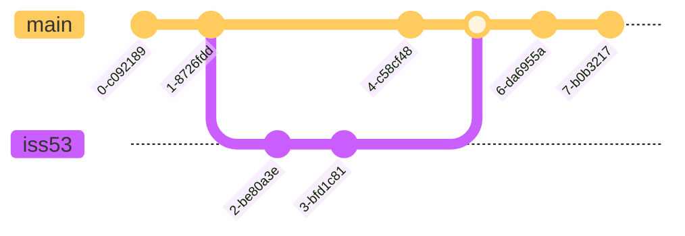

## Creating a New Branch

```git
git branch <branch name>
git branch testing
```

`HEAD` is a pointer to the local branch you’re currently on.
The git branch command only created a new branch — it didn’t switch to that branch. So you’re still on master branch instead of the new branch. 

### Switching Branches
```git
git checkout testing
```
This moves HEAD to point to the testing branch.

### Creating a new branch and switching to it at the same time
```git
git checkout -b <branch name>
```

## Branch Merging
Merge iss53 branch into master
    * check out the branch you wish to merge into
    * run the git merge command

```git
git checkout master
git merge iss53
```



## Branch Management
### Listing Current Branches
```python
git branch
git branch -v # (1)
```

1.  To see the last commit on each branch

### Changing a branch name
```python
git branch --move bad-branch-name corrected-branch-name # (1)
git push --set-upstream origin corrected-branch-name # (2)
git push origin --delete bad-branch-name # (3)
```

1.  Rename the branch locally
2.  Push the change
3.  Delete the branch with the bad name

## Remote Branches

### Remote-tracking Branch
* Remote-tracking branches are references to the state of remote branches. They’re local references that you can’t move; Git moves them for you whenever you do any network communication, to make sure they accurately represent the state of the remote repository. Think of them as bookmarks, to remind you where the branches in your remote repositories were the last time you connected to them.
* Remote-tracking branch names take the form `<remote>/<branch>`
    * the master branch on your origin remote: `origin/master`
    * a partner pushed up an iss53 branch: might have your own local iss53 branch, but the branch on the server would be represented by the remote-tracking branch `origin/iss53`


### Tracking Branch
* Tracking branches are local branches that have a direct relationship to a remote branch. 
* When you clone a repository, it generally automatically creates a master branch that tracks origin/master.


```git title='set up other tracking branches'
git checkout -b <branch> <remote>/<branch>
```

```git title='set up tracking branch for a existing local branch'
git branch -u origin/serverfix
git branch --set-upstream-to origin/serverfix
```

```git title='list tracking branches you have set up' hl_lines="1"
git fetch --all; git branch -vv
  iss53     7e424c3 [origin/iss53: ahead 2] Add forgotten brackets
  master    1ae2a45 [origin/master] Deploy index fix
* serverfix f8674d9 [teamone/server-fix-good: ahead 3, behind 1] This should do it
  testing   5ea463a Try something new
```

### Deleting Remote Branches
```python
git push origin --delete serverfix # (1)
```

1.  delete your serverfix branch from the server


## Rebasing

