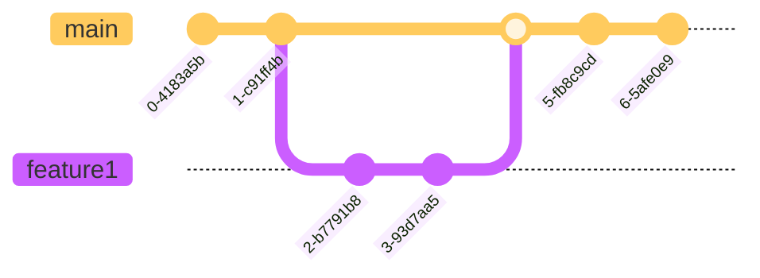

## Flowchart


## `git init`
Initiate local repo

``` git
cd /Users/joy/Documents/R
git init
```

## `git add`
Track file/add to stage
``` git
git add Git.Rmd
git add .
```

## `git rm`
``` git title='Untrack file'
git rm Git.Rmd
```

``` git title='Keep in cache but not track'
git rm -- cache Git.Rmd
```

## `git reset`
``` git title='Remove from stage'
git reset HEAD Git.Rmd
```

## `git commit`

``` git title='Commit staged files and edit message in editor'
git commit
```

``` git title='Commit staged files and edit short message'
git commit -m 'enter message here'
```

``` git title='Stage and commit at the same time'
git commit -a -m 'message'
git commit -am 'message'
```

## `git status`
``` git title='Check git status'
git status
```

## `git diff`
``` git title='Check file edit details (unstaged changes)'
git diff
```

``` git title='Check file edit details (between staged one and committed one)'
git diff --staged
```

## `git log`
``` git title='Check history commit'
git log
git log --pretty=oneline 
git log --pretty=format:"%h-%an, %ar:%s" 
git log --graph
git log --graph --all
```

- `%h` simple hash
- `%an` author
- `%ar` edit date (from now)
- `%ad` edit date
- `%s` message


``` git title='Check part of the log history'

git log featureA..origin/featureA
```
show the commit list included in the later branch (origin/featureA) but not in the former (featureA)

## `git clone`
``` git title='Create bare repository'
git clone --bare /Users/joy/Documents/R R.git
```

``` git title='Clone the entire repo'
git clone https://github.com/JoyDing0330/Rnote.git
```

``` git title='Cloning to a specific folder'
git clone <repo> <directory>
git clone ssh://john@example.com/path/to/my-project.git my-project
```

## `git remote`
``` git title='Remote repository connect'
git remote add origin https://github.com/JoyDing0330/Rnote.git
```

``` git title='Check remote repo'
git remote
```

``` git title='Obtain more information about the remote repository'
git remote show origin``
```

``` git title='Change remote repo name'
git remote rename old_name new_name
```

## `git push`

``` git title='Push to main branch'
git push origin main
```

``` git title='Push to feature1 branch'
git push origin feature1
```

``` git title='Push local feature1 branch to remote feature2 branch in origin repo'
git push origin feature1:feature2
```

``` git title='Push the locally new-created branch featureA to remote origin'
git push -u origin featureA
git push --set-upstream origin featureA
```

``` git title='Push the locally new-created branch featureB to the branch featureBee on remote origin'
git push -u origin featureB:featureBee
git push remote_name local_branch:remote_branch
```

``` git title='Delete remote branch'
git push origin --delete serverfix
```

## `git branch`

``` git title='Print branch list'
git branch --list
```

``` git title='Create new branch feature1'
git branch feature1
```

``` git title='Change the tracked upstream branch '
git branch -u origin/serverfix
git branch --set-upstream-to origin/serverfix
```
``` git title='Delete branch'
git branch -d feature1
```

``` git title='See the last commit for each branch'
git branch -v
```

``` git title='See local branch and [tracked remote branch] and the last commit record'
git branch -vv
```

``` git title='See all branch (remote branch is in red)'
git branch -a
```

## `git checkout`

``` git title='Change to feature1 branch'
git checkout feature1
git switch feature1
```

``` git title='Create branch and switch to that branch'
git checkout -b feature2
```

``` git title='Create a local branch named serverfix from remote origin/feature1'
git checkout -b serverfix origin/feature```

## `git fetch`

``` git title='Fetch the master branch from remote to local origin/mymaster'
git fetch origin master:refs/remotes/origin/mymaster
```

``` git title='Fetch multiple branches'
fit fetch origin master:refs/remotes/origin/mymaster \ topic:refs/remotes/origin/topic
```

``` git title='Fetch all of the tracked branches'
git fetch --all
```

## `git merge`

``` git title='Merge feature1 to main branches'
git checkout main
git merge feature1
```




## `git rebase`

``` git title='Rebase the topicbranch to the basebranch'
git rebase <basebranch> <topicbranch>
```

Or
``` git title='Rebase the topicbranch to the basebranch'
git checkout <topicbranch>
git rebace <basebranch>
```

## `git reset`

``` git
head # this commit
head~ # last commit
head~2 # the one before last commit
```
``` git title='Cancel the commit but the file is still stages (soft)'
git reset head~ --soft
```

``` git title='Cancel the commit and the file is not staged'
git reset head~
```

``` git title='Cancel the commit and remove the edits'
git reset head~ --hard
```

## `git stash`

``` git title='Save the unfinished work and keep the working directory clean to checkout to another branch'
git stash
```

``` git title='Restore the saved work'
git stash apply`
```

``` git title='Get the store list, {0} is the last one'
git stash list
```

``` git title='Get the previous save thing'
git stash apply stash@{2}
```

``` git title='Drop a stash record'
get stash drop stash@{0}
```

## `git sqush`

```
git checkout -b featureBV2 origin/master
git merge --squash featureB
```

## `.gitignore`
``` git title='ignore all except one folder/file'
*
!folder
!folder/*
```

## Show current local repository

`git rev-parse --show-toplevel`

## Nano Editing

- `Ctrl+O` or `i` enter message
- `Ctrl+X` or `Ese:wq` exit
- `Ctrl+C` cancel


## Branches
- The refs for local branches are stored in the `./.git/refs/heads/`
- Remote branch refs live in the `./.git/refs/remotes/`
- To view your remote branches, simply pass the -r flag to the git branch command. `git branch -r`
- If you wish to set tracking information for this branch you can do so with:
`git branch --set-upstream-to=origin/<branch> add_line`
